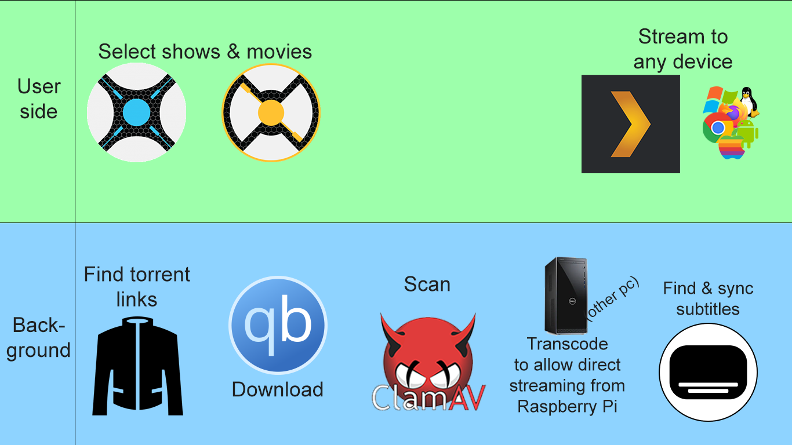

# Media Raspberry Pi

Do you have a Raspberry Pi laying around and a computer that's idling? Rework it into the ultimate torrenting & streaming box in minutes!

---

## Why the external computer?
tl;dr: the external computer will convert the files into a format that the Raspberry Pi/Plex can stream without effort.

 

A Raspberry Pi isn't a CPU powerhouse. It can run basic things, but something like transcoding/converting video files is above its pay grade. But Plex requires that the media has to be transcoded from the server side, so the client side (whether that be a browser, a chromecast, or a mobile app) doesn't have to exert the energy. You can imagine that the Raspberry Pi isn't made for that task. However: if the media in question is in a codec natively supported by the client, no transcoding will be needed. With some research and testing, along with an amazing [script](https://github.com/mdhiggins/sickbeard_mp4_automator), I found a setting that allows original quality streaming to many devices (tested on Chromecast, Windows client, Firefox, Chrome, Android and iPhone). So if you have a computer that's got some spare CPU power laying around, put it to some good use!

---

## Getting started
The instructions have been written down in the [wiki here](https://github.com/Denperidge/media-raspberry-pie/wiki)! But feel free to reach out with any questions or suggestions.

## Thanks
The amazing communities behind Qbittorrent, Sonarr, Radarr, Jackett, Bazarr, ffsubsync, sickbeard_mp4_automator, Plex, ClamAV, LinuxServer.io, Docker... This is merely a quick setup & tutorial to connect all these amazing services.

## Contributing
Feel free to report any issues or suggest a pull request!

## License
Media-Raspberry-Pie is released under the [MIT](LICENSE) license.
